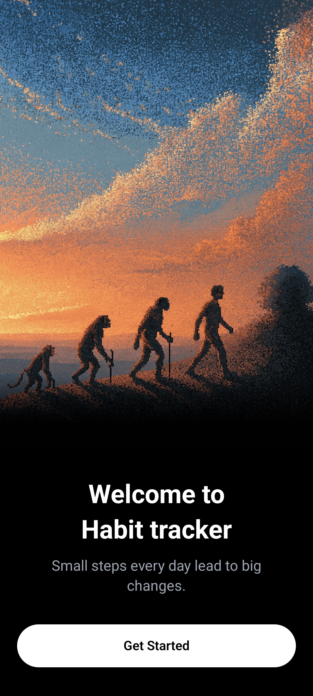
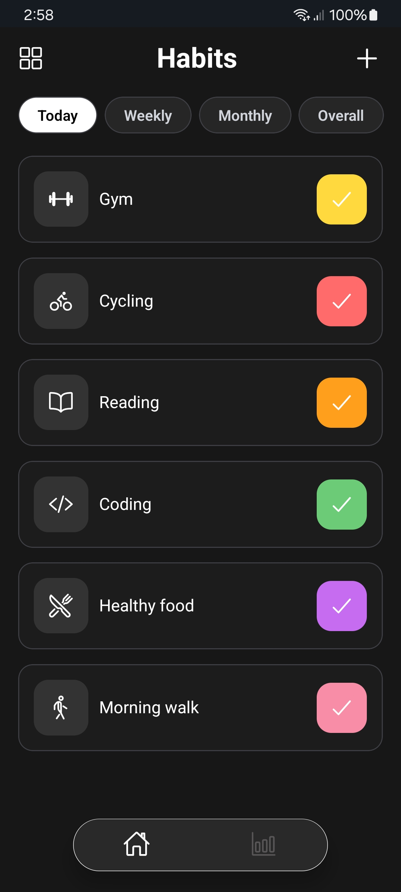
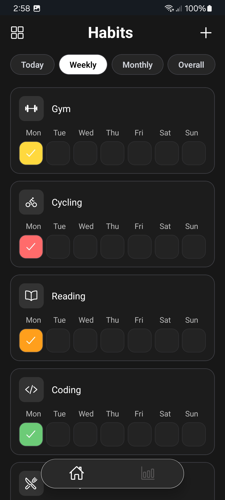
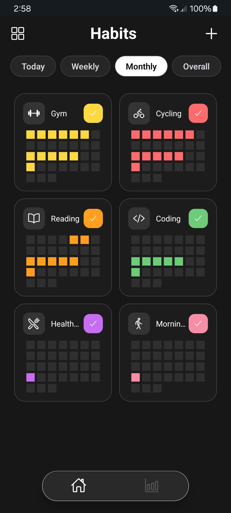
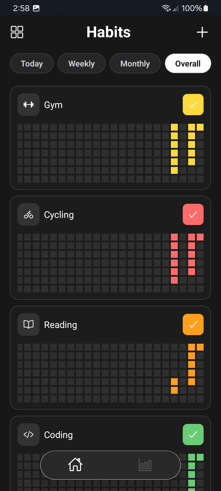
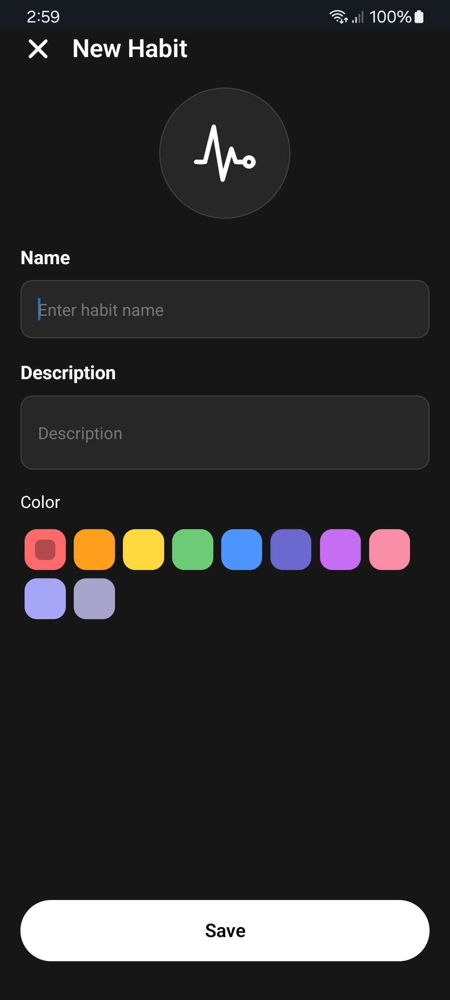
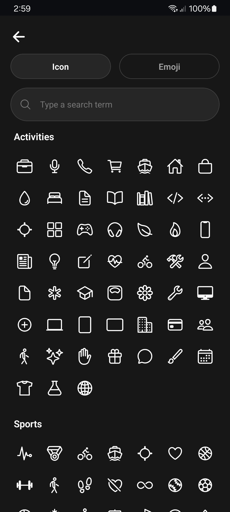

<!-- Hero Image -->

<!--  -->


# Habit Tracker App

A clean, minimal, open-source habit tracker built to help users build consistency over time.  
Focused on simplicity, visual progress, and a distraction-free experience.

Built in public and open for learning, contributions, and customization.

---

## Screenshots

<table>
  <tr>
    <td></td>
    <td></td>
    <td></td>
    <td></td>
    <td></td>
  </tr>
  <tr>
    <td></td>
    <td></td>
    <td></td>
    <td></td>
  </tr>
  
</table>

<!-- 

 -->

---

## Tech Stack

- **Expo** (React Native)
- **TypeScript**
- **Zustand** for state management
- **AsyncStorage** for local persistence
- **Expo Router**
- **React Native Reanimated**

---

## Features

- ➕ Create and manage habits
- 📊 Visual progress tracking  
  _(daily, weekly, monthly, yearly)_
- 💾 Data saved locally on device
- 🚀 Smooth onboarding flow
- ✏️ Edit, reorder, delete, and archive habits
- 🌙 Dark mode only (intentional design choice)
- ⚡ Fast, lightweight, and offline-first

---

## Planned Features

- 📈 Analytics dashboard
- 💳 Payments & subscriptions with RevenueCat
- 📤 Export / Import habit data
- 🧩 Home screen widgets
- 🎨 Theme customization

---

## Custom Features & Work

If you’re interested in:

- Implementing **planned (advanced) features**
- **Customizing** this app for your product or startup
- Building a **similar app from scratch**

You can reach out to me at:

📧 **your-email@example.com**

I’m open to freelance work, collaborations, and long-term projects.

---

## Getting Started

```bash
git clone https://github.com/your-username/habit-tracker.git
cd habit-tracker
npm install
npm run start
```
